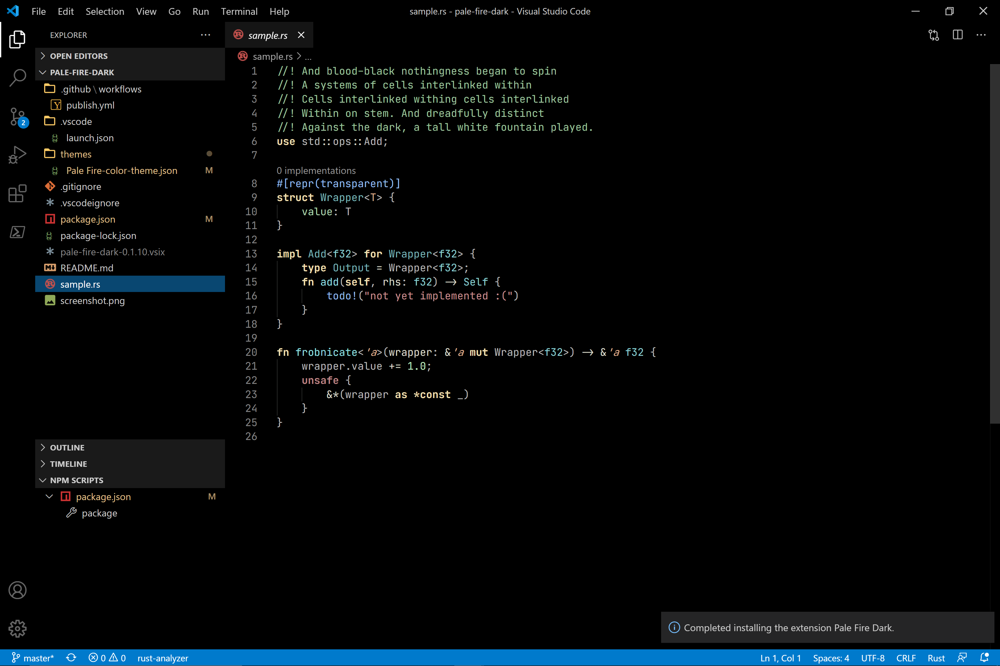

# Pale Fire Dark



A color theme for VS Code based on [Pale Fire](https://github.com/matklad/pale-fire).

I would recommend also installing [Dark+ (Full black)](https://github.com/DhruvDh/dark-plus-full-black), and using [Theme by Language](https://marketplace.visualstudio.com/items?itemName=jsaulou.theme-by-language) to use this theme only when you are writing code in Rust, and the a full black version of vscode's Dark+ theme otherwise.

This can be accomplished by adding this to you settings.json after every extension is instsalled - 

```javascript
	"workbench.colorTheme": "Dark+ (Full black)",
	"theme-by-language.themes": {
		"*": "Dark+ (Full black)",
		"rust": "Pale Fire Dark"
	},
```

## License

GPL3, like Pale Fire.
